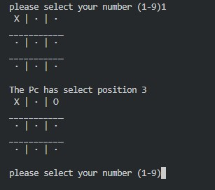
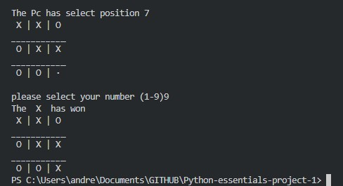
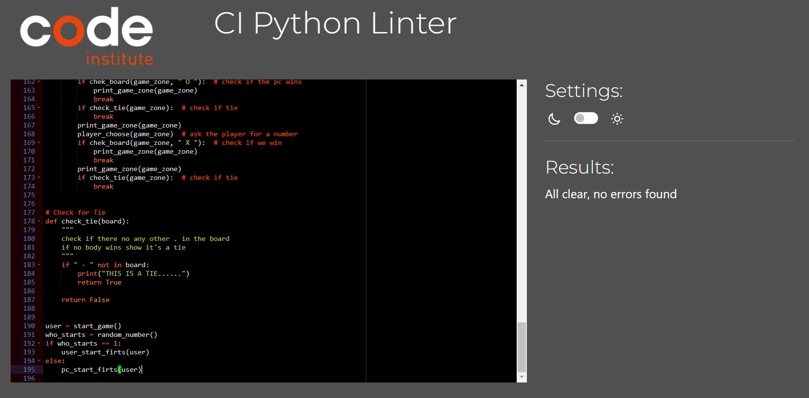

# Tic-Tac-Toe Machine VS Human

Welcome to the most competitive game, now you can test your skill against the computer, who will be the winner??

The player can try to beat the machine by being the first to complete a line of three pieces in the square, the player who starts first has a better chance of winning so let's ***see how lucky you are.***
_____

## How to Play

Tic-tac-toe is a classic two-player game where the goal is to get three of your symbols (either X or O) in a row, either horizontally, vertically, or diagonally, on a 3x3 grid.

### Rules:
- The PC randomly chooses who plays first.
- If the player start firs will be "X", if the pc start will be "O"
- The first one to complete a line of three symbols wins
- If there a Tie or you win,  you have the opcion to start again 

## Features

### Existing Features

* Start the game, Board generation and choice of who starts

    *   Show the rules
    *   Ask for a user name
    *   will show whos going to start, if it is the player ask for position if it is the pc show the board with the selection made

* Update Board 

    * Everytime you select a position or the pc, the update board will be displayed.

* Win or tie

    * When a player or pc Wins the game de las Update board will be display and if it is the player the result will be "You win" but if it is the PC the resulr will be "You lose"

    * When there is not winner it's just a "Tie" message with an option to play again 
## win

----
## tie

## Future Features

* Select difficulty

## Data Model

I decided to use a list as my model it's a global element so I can use to check anything. I print the area game iterating on each of the elements and put some complements to make looks better and after that display into the terminal.

The game has  a while loop so the steps are repetitive, within the loop there are flow control elements so the program can decided what to do in the different possibilities.

## Testing

I have manually tested this project by doing the following:

- Passed the code trough a [CI Python Linter](https://pep8ci.herokuapp.com/) and confirmed there are no problems

- Given invalids inputs: strings or numbers out of range or try to used a taken position
- Tested in my local terminal and the Code Institute Heroku terminal

## Bugs

* The pc always loses, so It's a random choise it's very easy to win.

### Solve Bugs
* Using [CI python Linter](https://pep8ci.herokuapp.com/) Fixin wrong identation

### Remaining Busgs

* No bugs remaining

## Validator Testing
* PEP8
    - All clear, no errors found
## Deployment

This project was deployed using Code Institute's mock terminal for Heroku

* Steps for deplyment:
    - Fork or clone this repository [Tic-Tac-Toe Machine VS Human](https://github.com/richard9106/Python-essentials-project-1)

    - Create a new Heroku app
    - Set the buildbacks to Python and NodeJs in that order
    - link the Heroku app to the repository
    - click on deploy

## Credits

* Code Institute for the deployment terminal
* Tic Tac Toe inspiration [Medium](https://medium.com/@bblkmn5/tic-tac-toe-command-line-game-python-82e07b7acdfd)

---

