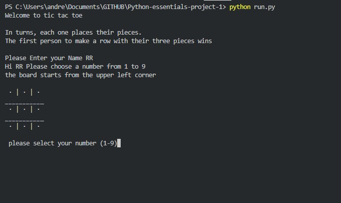
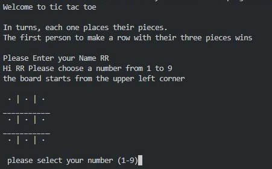

# Tic Tac Toe vs PC

Welcome to the most competitive game, now you can test your skill against the computer, who will be the winner

The player can try to beat the machine by being the first to complete a line of three pieces in the square, the player who starts first has a better chance of winning so let's ***see how lucky you are.***
_____

## How to Play

Tic-tac-toe is a classic two-player game where the goal is to get three of your symbols (either X or O) in a row, either horizontally, vertically, or diagonally, on a 3x3 grid.

### Rules:
- The PC randomly chooses who plays first.
- If the player start firs will be "X", if the pc start will be "O"
- The first one to complete a line of three symbols wins
- If there a Tie or you win,  you have the opcion to start again 

## Features

### Existing Features

* Start the game, Board generation and choice of who starts

    *   Show the rules
    *   Ask for a user name
    *   will show whos going to start, if it is the player ask for position if it is the pc show the board with the selection made

* Update Board 

    * Everytime you select a position or the pc, the update board will be displayed.

* Win or tie

    * When a player or pc Wins the game de las Update board will be display and if it is the player the result will be "You win" but if it is the PC the resulr will be "You lose"

    * When there is not winner it's just a "Tie" message with an option to play again 

----

## Future Features

* Select difficulty

* Timer or Count Down

## Data Model

I decided to use a list as my model it's a global element so I can use to check anything. I print the area game iterating on each of the elements and put some complements to make looks better and after that display into the terminal.

The game has  a while loop so the steps are repetitive, within the loop there are flow control elements so the program can decided what to do in the different possibilities.

## Testing

- Your code must be placed in the `run.py` file
- Your dependencies must be placed in the `requirements.txt` file
- Do not edit any of the other files or your code may not deploy properly

## Bugs

### Solve Bugs
*
*

### Remaining Busgs

* No bugs remaining

## Deployment

When you create the app, you will need to add two buildpacks from the _Settings_ tab. The ordering is as follows:

1. `heroku/python`
2. `heroku/nodejs`

You must then create a _Config Var_ called `PORT`. Set this to `8000`

If you have credentials, such as in the Love Sandwiches project, you must create another _Config Var_ called `CREDS` and paste the JSON into the value field.

Connect your GitHub repository and deploy as normal.

## Credits

The deployment terminal is set to 80 columns by 24 rows. That means that each line of text needs to be 80 characters or less otherwise it will be wrapped onto a second line.

---

